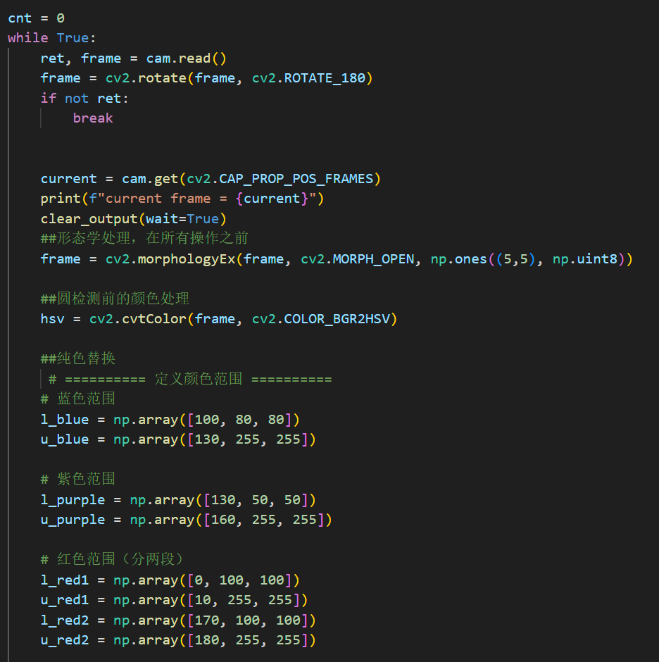
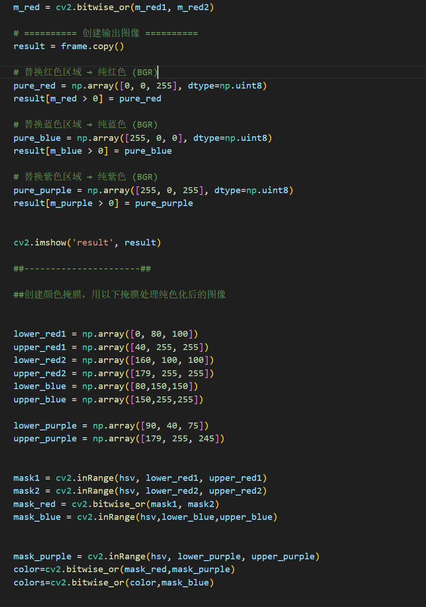
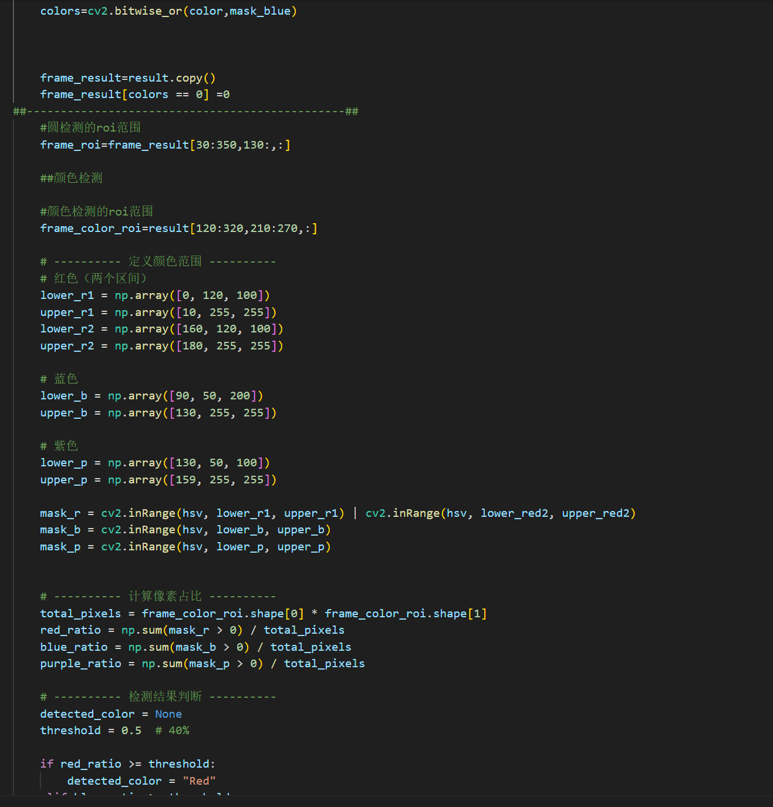
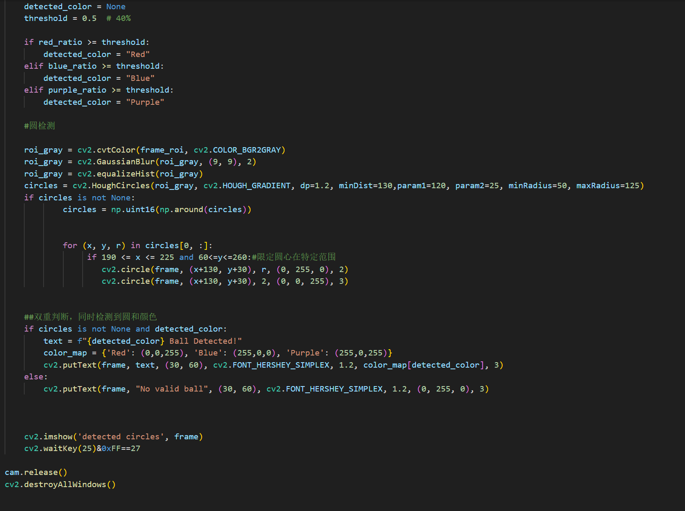
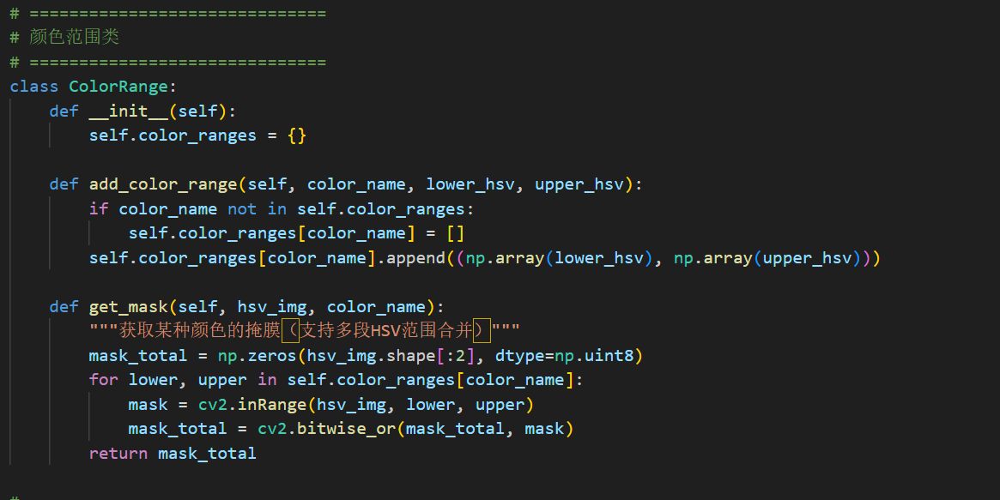
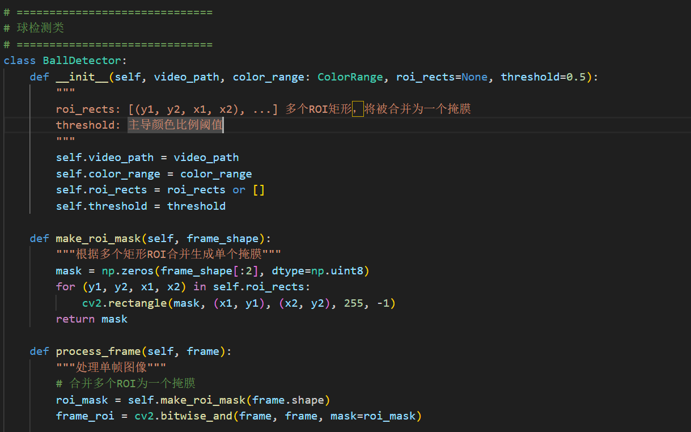
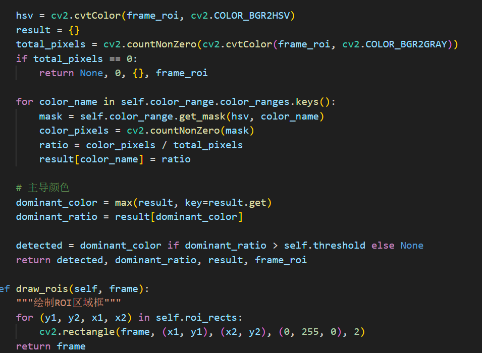
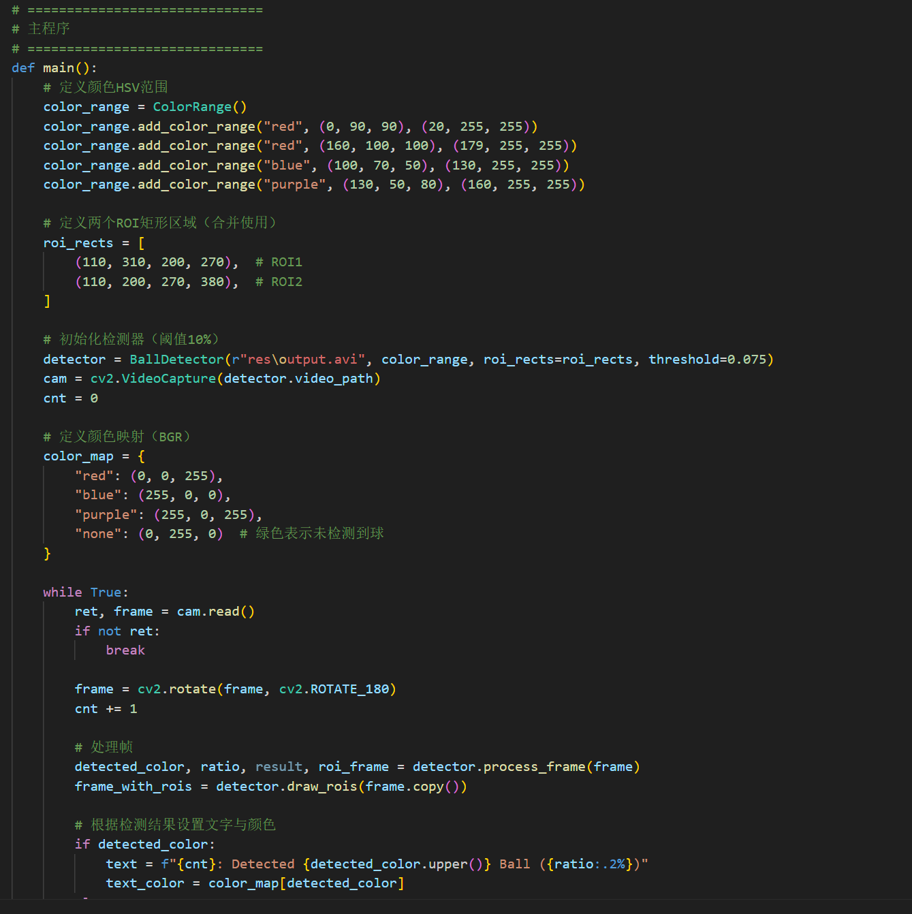
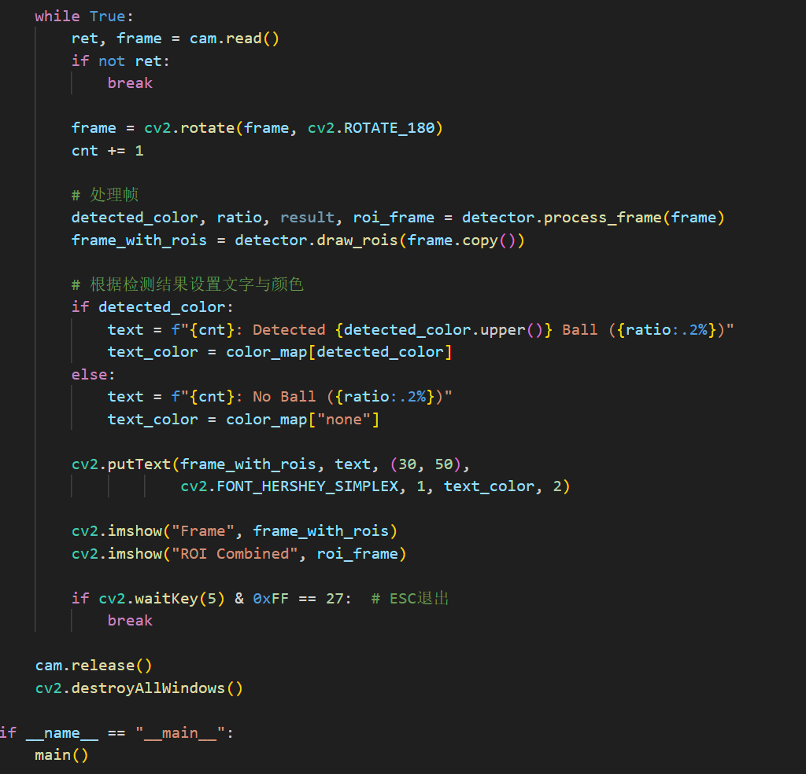

# 代码思路
## 这个作用我用了两种方法，一种是霍夫圆检测+颜色检测（本来是想着背景会干扰颜色检测，后来发现我是傻逼），另一种是直接检测三种颜色的多少，超过阈值的就判定为有（）色的圆，提交的是直接检测颜色的版本

### 以下是霍夫圆版本的截图  
  
  
  一开始用形态学处理去除噪点并平滑边缘，便于圆检测
同时将一部分颜色用纯色替代，使圆更容易检出（大概吧，至少我是这样觉得的）
----------------------------------

  
  
  
  
  
  接下来创建颜色掩膜，过滤掉背景，只留下球
同时设定两个roi区域，一个是圆检测时用的，一个是颜色检测时用的
------------------------------

  
  
  
  颜色检测部分，用来检测是哪个球
------------------------------------

  

  
  
  
  圆检测，检测是否有圆，在检测时我限定了圆的圆心位置
最后双判断，同时检测到圆和颜色才算
---------------------------------

  
  
  
  
  
#### 调参调了好久，我是傻逼
  
  
  
  
  
  
  
### 下面是直接颜色检测的版本
  
  创建颜色掩膜
-------------------------------------

  

  
  
  
  划出多个roi区域并合并为一整个
这样可以避免一些无关的结构也在颜色像素数计算里，同时避开一些过曝光的区域
-----------------------------------

  
  
  

  
  
  
  
  
  
  
  这几张代码里的注释都有
----------------------------------------------

  
  